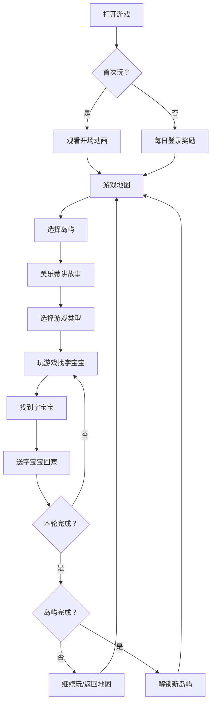

# 美乐蒂识字大冒险 - 游戏设计方案

> 专为 6 岁儿童设计的识字游戏，通过游戏化方式让孩子在冒险中自然识字。
>
> 创建时间：2026-02-27

---

## 📋 项目概述

### 目标用户
- **年龄**：6 岁（学龄前/小学一年级）
- **特点**：注意力有限、喜欢游戏化体验、对粉色和小马宝莉/美乐蒂感兴趣

### 设计理念
1. **游戏 > 学习**：没有"学习任务"的感觉，只有"冒险找字宝宝"
2. **正向反馈**：每次答对都有音效 + 动画 + 奖励
3. **自主选择**：孩子可以选择喜欢的游戏类型
4. **收集乐趣**：字宝宝住进城堡、收集贴纸、购买装饰
5. **适度原则**：每轮 3 个字，保持意犹未尽的感觉

### 核心价值
- 让孩子**主动要求玩**，而不是被动学习
- 每天 5 分钟，在快乐中自然识字
- 建立成就感和自信心

---

## 🎮 游戏设计

### 世界观设定

```
在很远的地方，有一个神奇的字宝宝王国...
可是有一天，一场大雾把王国笼罩，
所有的字宝宝都迷路了！😢

美乐蒂需要一位小小英雄的帮助，
一起寻找字宝宝，送它们回家！
```

**玩家角色**：小小英雄
**引导角色**：美乐蒂（🎀）
**收集对象**：字宝宝（每个汉字都是一个可爱的小精灵）

---

### 游戏流程



### 核心循环

1. **选择岛屿** → 2. **选择游戏** → 3. **找字宝宝** → 4. **送回家** → 5. **获得奖励**

每轮找 **3 个字宝宝**，每个岛屿有 **5 个字宝宝**

---

### 岛屿关卡设计

| 岛屿 | 名称 | 主题 | 解锁条件 |
|------|------|------|----------|
| 1 | 🌸 花花岛 | 家庭篇、身体篇 | 初始解锁 |
| 2 | 🫧 泡泡海 | 数字篇、自然篇 | 完成花花岛 3 个字 |
| 3 | ⭐ 星星山 | 动物篇、植物篇 | 完成泡泡海 3 个字 |
| 4 | 🧩 拼图森林 | 颜色篇、方向篇 | 完成星星山 3 个字 |
| 5 | 🌙 月光城堡 | 学校篇、时间篇 | 完成拼图森林 3 个字 |

**每个岛屿 5 个字宝宝**，完成后解锁下一个岛屿

---

### 三种游戏类型

#### 1. 捉迷藏 🙈

**玩法**：从 4 个选项中找出正确的字

**界面**：
- 4 张卡片，每张显示一个汉字
- 卡片有弹跳动画
- 点击正确答案进入下一题

**反馈**：
- 正确：播放欢快音效 + 彩带动画
- 错误：卡片变半透明 + 温和提示"再试试"

---

#### 2. 泡泡消除 🫧

**玩法**：戳破含有正确字的泡泡

**界面**：
- 5 个彩色泡泡，每个包含一个字
- 泡泡有浮动动画（上下飘动）
- 泡泡大小不一，颜色渐变

**反馈**：
- 正确：泡泡爆破效果（💥）+ 音效
- 错误：泡泡变灰色 + 提示"不对哦"

---

#### 3. 拼图识字 🧩

**玩法**：选择正确的字拼到拼板上

**界面**：
- 上方显示目标字
- 下方 4 个部件选项
- 中间拼图板

**反馈**：
- 正确：字宝宝出现在拼板上 + 出现动画
- 错误：选项变半透明 + 提示"再试试"

---

### 奖励系统

#### 货币：爱心 💖

**获取方式**：
- 找到字宝宝：+3 爱心/个
- 每日登录：+5~10 爱心
- 完成岛屿：额外奖励

**消耗方式**：
- 购买城堡装饰（20-60 爱心不等）

---

#### 收集品：贴纸 🎨

**获取方式**：
- 每日登录随机获得

**种类**：
- 🌸 🎀 ⭐ 🌙 🦄 🍬 🎨 🎪 🌟 🌺

**用途**：
- 展示在背包中
- 成就象征

---

#### 城堡装饰 🏰

**可购买装饰**：

| 装饰 | 价格 | 稀有度 |
|------|------|--------|
| 🌸 樱花 | 20💖 | 普通 |
| ⭐ 星星 | 20💖 | 普通 |
| 🎀 蝴蝶结 | 20💖 | 普通 |
| 🌙 月亮 | 30💖 | 稀有 |
| ❤️ 爱心 | 30💖 | 稀有 |
| 🎨 画板 | 30💖 | 稀有 |
| ✨ 闪光 | 35💖 | 稀有 |
| 🍬 糖果 | 25💖 | 普通 |
| 🎪 帐篷 | 40💖 | 史诗 |
| 🌈 彩虹 | 45💖 | 史诗 |
| 🦄 独角兽 | 50💖 | 传说 |
| 💎 钻石 | 60💖 | 传说 |

---

### 每日登录奖励

**流程**：
1. 打开游戏 → 2. 弹出礼物盒 🎁 → 3. 点击打开 → 4. 获得奖励

**奖励内容**：
- 爱心：5-10 个（随机）
- 贴纸：1 个（随机，不重复获得）

**设计意图**：
- 鼓励每天打开游戏
- 登录即有奖，无压力

---

## 📚 字库设计

### 字库结构

共 **100 个汉字**，分为 **5 个主题**，每个主题 **20 字**

### 字库列表

#### 第 1 关：家庭篇 🏠
```
爸妈爷奶哥姐弟妹我人家
亲情父母子女儿女宝贝园
```

#### 第 2 关：身体篇 👶
```
头耳目口鼻手足心牙舌
毛发脸眼眉肩背肚腿脚
```

#### 第 3 关：数字篇 🔢
```
一二三四五六七八九十
百千万第几多少半双对
```

#### 第 4 关：自然篇·天地 🌙
```
天地日月星辰风云雨雪
雷电雾霜露虹霞晴阴空
```

#### 第 5 关：自然篇·山水 🏔️
```
山水火土金石木禾田
河江海湖池溪泉岛屿岸坡谷
```

### 字卡数据结构

```javascript
{
  char: "爸",           // 汉字
  pinyin: "bà",        // 拼音
  group: "爸爸",        // 组词
  example: "我爱爸爸"   // 例句
}
```

---

## 🎨 视觉设计

### 配色方案

```css
--pink-light: #FFE4E1   /* 浅粉 */
--pink-medium: #FFB6C1  /* 中粉 */
--pink-dark: #FF69B4    /* 深粉 */
--pink-soft: #FFC0CB    /* 柔粉 */
--purple-soft: #DDA0DD  /* 柔紫 */
--blue-soft: #87CEEB    /* 柔蓝 */
--white: #FFFFFF        /* 白色 */
--gold: #FFD700         /* 金色 */
```

### 字体
- **中文**：ZCOOL KuaiLe（站酷快乐体）- 卡通风格
- **备用**：系统默认无衬线字体

### 动画风格
- **柔和**：使用 ease 缓动函数
- **弹性**：bounce、pulse 动画
- **可爱**：浮动、跳动效果

### 关键动画

| 动画名 | 用途 | 效果 |
|--------|------|------|
| bounce | 角色、标题 | 上下跳动 |
| fadeIn | 屏幕切换 | 渐入 |
| float | 岛屿、泡泡 | 浮动 |
| pulse | 高亮提示 | 缩放脉冲 |
| celebrate | 完成庆祝 | 旋转 |

---

## 🏗️ 技术架构

### 技术栈

- **纯前端**：HTML + CSS + JavaScript
- **无框架**：原生 JS，零依赖
- **本地存储**：localStorage
- **音频**：Web Audio API（生成音效）
- **语音**：Speech Synthesis API（朗读）
- **动画**：CSS Animation + Canvas + requestAnimationFrame

### 项目结构

```
merolite-literacy-game/
├── index.html          # 主页面
├── styles/
│   └── main.css       # 样式表
├── src/
│   └── game.js        # 游戏主逻辑
├── data/
│   └── wordData.js    # 字库数据
└── README.md          # 说明文档
```

### 核心类

```javascript
class AdventureGame {
  // 游戏状态管理
  state = {
    hasStarted,
    adventureDay,
    lovePoints,
    foundWords[],
    visitedIslands[],
    stickers[],
    ownedDecorations[],
    lastLoginDate,
    islandsProgress{}
  }

  // 核心方法
  init()              // 初始化
  saveState()         // 保存存档
  loadState()         // 加载存档
  checkDailyLogin()   // 检查每日登录

  // 游戏流程
  enterIsland()       // 进入岛屿
  startLevel()        // 开始关卡
  nextWord()          // 下一个字
  sendWordHome()      // 送字宝宝回家

  // 游戏类型
  startHideSeekGame() // 捉迷藏
  startBubbleGame()   // 泡泡消除
  startPuzzleGame()   // 拼图识字

  // UI
  showScreen()        // 切换屏幕
  updateUI()          // 更新 UI
  updateMap()         // 更新地图

  // 特效
  playSound()         // 播放音效
  showConfetti()      // 彩带庆祝
  speak()             // 语音朗读
}
```

### 存档设计

存档存储于 `localStorage`，键名：`merolite-adventure`

```json
{
  "hasStarted": true,
  "adventureDay": 5,
  "lovePoints": 45,
  "foundWords": ["爸", "妈", "爷", "奶"],
  "visitedIslands": [1, 2],
  "stickers": ["🌸", "🎀", "⭐"],
  "ownedDecorations": ["🌸", "⭐", "🎀", "🌙"],
  "lastLoginDate": "2026-02-27",
  "islandsProgress": { "1": 4, "2": 0, "3": 0, "4": 0, "5": 0 }
}
```

---

## 📱 适配设计

### iPad 优化

- **触摸友好**：大按钮（最小 44x44px）
- **横竖屏**：都支持
- **添加到主屏幕**：支持 PWA 模式
- **防误触**：`-webkit-tap-highlight-color: transparent`

### 响应式断点

```css
/* 桌面/iPad 横屏 */
@media (min-width: 768px) { }

/* 手机/iPad 竖屏 */
@media (max-width: 600px) { }
```

---

## 🎯 教育设计

### 识字原理

1. **重复暴露**：同一个字在不同场景出现
2. **多感官**：视觉（字形）+ 听觉（读音）+ 触觉（点击）
3. **情境学习**：组词 + 例句，理解字的用法
4. **渐进难度**：从熟悉的字开始（家庭、身体）

### 复习机制

- 岛屿进度系统：每个岛屿 5 个字，需要多次游玩完成
- 自动筛选未学字：已学的字不会重复出现
- 每轮 3 个字：符合儿童注意力特点

### 正向激励

- **无失败惩罚**：答错只是"再试试"
- **即时反馈**：每次答对都有奖励
- **渐进成就**：从 1 个字到 5 个字，小步快跑

---

## 📊 数据分析

### 关键指标

| 指标 | 目标值 | 说明 |
|------|--------|------|
| 日活跃天数 | ≥5 天/周 | 通过每日登录奖励激励 |
| 单次游戏时长 | 5-10 分钟 | 保持意犹未尽 |
| 识字进度 | 15-30 字/周 | 每周 3-5 轮 |
| 岛屿完成率 | ≥80% | 难度适中 |

### 存档分析

通过分析存档数据，可以了解：
- 孩子的学习进度
- 偏好哪种游戏类型
- 是否需要调整难度

---

## 🔄 迭代计划

### MVP 版本（已完成）
- ✅ 3 种游戏类型
- ✅ 5 个岛屿关卡
- ✅ 100 个字库
- ✅ 商店系统
- ✅ 每日登录奖励

### 后续优化

1. **更多字库**：扩展到 300-500 字
2. **更多游戏**：连线题、听音选字、笔画顺序
3. **更丰富互动**：字宝宝会走动、说话
4. **成就系统**：更多勋章和成就
5. **家长面板**：查看学习进度和报告

### 长期愿景

- 成为孩子每天主动打开的游戏
- 在快乐中完成幼小衔接识字
- 建立对汉字的兴趣和好感

---

## 📝 使用指南

### 部署方式

**本地运行**：
```bash
cd /Users/max/lobsterai/project/merolite-literacy-game
python3 -m http.server 8080
```

**iPad 访问**：
1. 确保电脑和 iPad 在同一 WiFi
2. 查看电脑 IP：`ifconfig | grep "inet "`
3. iPad Safari 访问：`http://电脑 IP:8080`
4. 分享 → 添加到主屏幕

### 家长建议

1. **不要催促**：让孩子自己决定什么时候玩
2. **适度陪伴**：初期可以一起玩，后面放手
3. **鼓励为主**：关注进步，不关注错误
4. **固定时间**：建议晚饭后 5 分钟

---

## 📄 许可证

**家庭自用** · 禁止商业使用

美乐蒂、小马宝莉为三丽鸥、孩之宝注册商标，本游戏为家庭自用项目。

---

## 🎵 更新日志

### v1.0.0 (2026-02-27)
- 🎉 初始版本发布
- 🎮 3 种游戏类型
- 🏝️ 5 个岛屿关卡
- 📚 100 个汉字
- 🏪 商店系统
- 🎁 每日登录奖励
- 💖 爱心货币系统
- 🎨 收集贴纸系统
